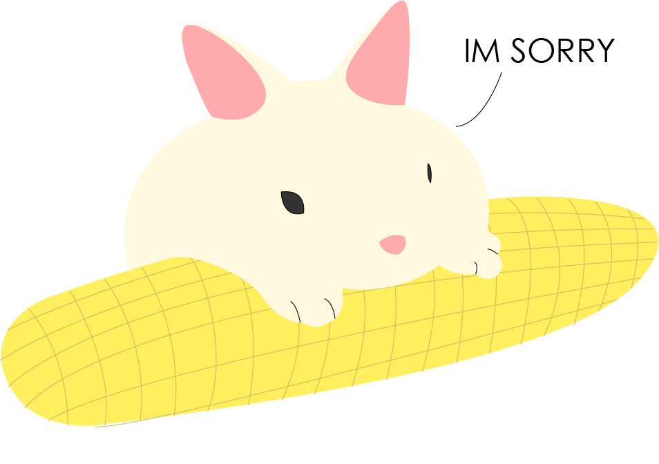

<!doctype html>
<html>
<head>
    <title>I'm Sorry my love</title>
    
    </head>
    <body>
        
        

    <h1> My apology to my princess</h1>
    <a class="button" href="#first">Click me</a>
        

        
        

        
im sorry love, despite all my sorrys and promises. you still get hurt because of me.

        <a class="button" href="#second">Click me</a>
        

        
        

            
I dont know when ill get better, but i promise you i will. for you, ill do my best to become the best version of me.

        <a class="button" id="btn3" href="#third">Click me</a>
        

        
        

        
I love you Sky, please dont leave me :(    Unblock me please 

            
        

    </body>
</html>
